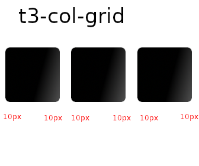

# web-grid-exam
A simple example of creation of a simple system grid like bootstrap.

The principal characteristics is the creations for cells with 'calc' function fo CSS:

```
.t3-col-grid .grid-item {
    width: calc((100% - 20px * 3) / 3);
```

